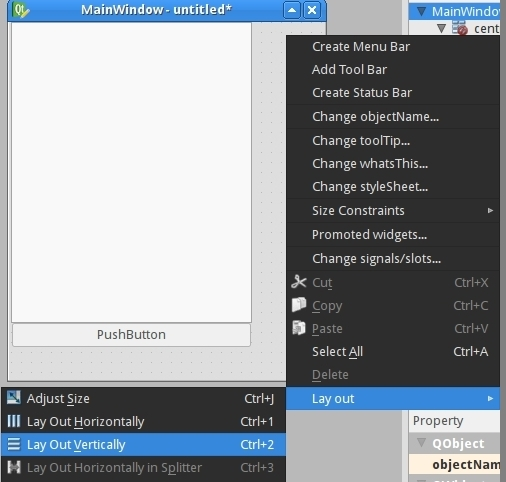

# pyqt with qt-designer

මුලින් ඔනි කරන tools ටික install කරගමු.

`sudo apt install python-qt4 pyqt4-dev-tools qt4-designer`

install කරගත්තු tools ටික හරියට වැඩ කියලා බලමු.

`pyuic4`

> Error: one inputui-file must be specified

එකත කොට ඔයාට “command not found” කියලා අවොත් ඔයා install කරගත්තු tools ට්ක හරියට වැඩ කරන්වා.

## Desing

දැන් Qt open කරගන්න“Main Window” එක තොරලා create කරගන්න.

දැන් ඔයට පුලුව්ම size එක වෙනස් කරගන්න, widgetbox එකෙන් objects drop කරලා දාන්නවා වගේ දේවල් කරන්න . ඔයාට ඔනි interface එක ඔයාට කැමති ඔයාට හුරු විදයට සරලව හදාගන්න්න.

එක පාරක් form එකෙ size එක අපිට ඔනි විදියට වෙනස් කරගත්තම අපි auto හැදුනු menu එක අයිකරන්න ඔනි.

අපිට ඔනි කරන objects ටික එකේ දකුනු පැත්තේ කෙලින් අතට තියෙන්වා "ObjectInspector" එක යටතේ. ඔයාට පුලුව්ම් objects අයින් කරන්න object උඩ right click කරලා delet එකෙන් , ඔනින් delete dutton එකෙන්නුත් පුලුවම්.

දැන් Main Form එකෙ size එක වෙනස් කරලා menu එක delete කරගන්න.

Qt Designer එකෙ "Widget Box" එකෙ "List Widget" එකෙන් “PushButton” එකෙ තොරලා main form එකට drop කරන්න.

## Layouts

මේ විදයට button එකක් drag දාල කරලා size එක වෙනස් කරලා මේවිදියට හදාගන්න . දැන් "View" එකේ "Previem" එක තෝරලා මේවගේපෙන්නවා ද කියලා බලන්න :

දැන් පොඩ්ඩක් බලන්න window එකේ size එක වෙනස් කරලා , එතකොට මේ වගේ ද?

ඔබ්ජෙච්ට්ස් ටික ඒ විදියටම තියෙනවා ඒ වුනාට main form එකේ size එක වෙනස් වෙනවා නේ ද? මේක හදාගන්න පුලුවම් ද? ඔව් පුලුවම් එකට ඔයා ලය layout එකක් පාවිච්චි කරන්න ඕනි. ඕකට සමාන්නයෙන් කියන්නේ layout එකක් දානවා කියලා.

Main Window එකට Layout එකක් කොහ්මත් එනවා එක නිසා අපිට අමුතුවෙන් එකක් දන්න ඕනි නැ . Main Window එක උඩ right click කරලා "Object Inspector" එකෙන් "Layout"&gt;"Lay out vertically" .ඕනි නම් හිස් තැනක right click කරලා ඒ option එකම තෝරන්නත් පුලුවම් මේ වගේ :

ඔයාගේ objects එකම oder එකට තියෙනවා ඔයාගේ layout එක වෙනස් උනත් , එවුනට එක ඔයාට කැමති තැනකට brag and drop කරන්න බැ.

අපි vertical layout දැන්මහම එකකට දාන objects ඔකොම තියෙන්නේ vertical oder එකකට . ඔයාට පුලුවම් ඔයා කැමති විදියට layout එකතු කරලා ඔයා කැමති විදියට හදාගන්න. නිකන් පල්ලේහා එක වගේ.

## Finishing Touches

....

source :: [https://nikolak.com/pyqt-qt-designer-getting-started/](https://nikolak.com/pyqt-qt-designer-getting-started/)

