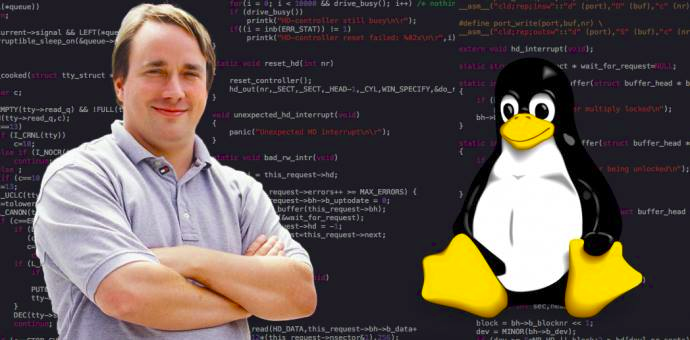

# ඉතිහාසයෙන් බිදක්

Anna සහ Nils Torvalds නම් දෙමාපියන්ට දාව 1969 සීතල උදුවප් මාසයේ 28 වන දින ෆින්ලන්තයේ හෙල්සින්කි නම් ග්‍රාමයේ කුඩා කිරිකැටියෙක් මෙලොව එලිය දකිනවා. ඔහු නමින් Linus Benedict Torvalds. රැකියාව වශයෙන් මෘදුකාංග ඉංජිනේරුවකු වූ මොහු පසුකලෙක ලෝකයේ විශාල පෙරලියක් ඇතිකළ පුදගලයෙක් බවට පත් වන්නේ 1991 සැප්තැම්බර් මස 11වන දින Linux කර්නලයේ නිර්මාණය කිරීමෙන් පසුවය. කර්නලය නිර්මාණය කිරීමෙන් පසුව Unixට සමාන වන ලෙස "free", "freak", සහ "x" යොදාගෙන මොහුට එය "Freax" ලෙස නම් කිරීමට අවශ්‍ය විය. නඩත්තු සහ සංවර්ධන කටයුතු සදහා මෙම කර්නලයේ කෙතසටහන් FUNET ආයතනයේ FTP සර්වරයකට උඩුගත කරන්නේ 1991 සැප්තැම්බර් මාසයේය. එම සර්වරයේ පරිපාලකයෙකු වූ Ari Lemmke මහතා මෙම "Freax" නම් නාමය "Linux" ලෙස මාරු කරන ලදී. 2006 වසර වන විට linux කර්නලයෙන් 2%ක් පමණ ප්‍රමාණයක් තනිවම නිර්මාණය කර ඇත්තේ Torvalds මහතා විසිනි. මෙම කර්නලය නිර්මාණය කිරීමට දහස් ගණනින් පුදගලයන් සහය වූ නිසා 2%ක් යනු පෞද්ගලිකව සැලකිය යුතු ප්‍රමාණයකි. එම නිසා Linux කර්නලයේ සිදුවන වෙනස්කම් පිළිබද තවමත් තීරණ ගන්නේ Torvalds මහතා විසින්ය.  
Written With ❤️ By -Sameera Madhushan- a.k.a άλφα Χ

